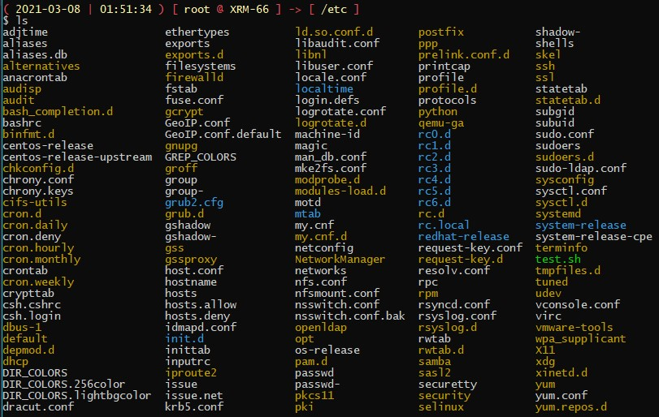

# My Bash Colors

This is nothing but a simple tweak at the bash terminal colors that I use,through the `PS1` and `LS_COLORS` environment variables, in order to improve the readability of the shell.

## Testing

To test it, run the following:

```bash
PS1='\n\[\033[1;31m\]( \[\033[1;33m\]\D{%Y-%m-%d} \[\033[1;31m\]| \[\033[1;33m\]\T \[\033[1;31m\]) [ \[\033[1;33m\]\u\[\033[1;31m\] @ \[\033[1;33m\]\h\[\033[1;31m\] ] -> [ \[\033[1;33m\]\w\[\033[1;31m\] ]\[\033[00m\]\n\$ '

PS2='\[\033[1;31m -> \033[00m'

LS_COLORS='no=00:fi=00:di=0;33:ln=00;36:pi=40;33:so=00;35:bd=40;33;01:cd=40;33;01:or=01;05;37;41:mi=01;05;37;41:ex=1;32:*.cmd=00;32:*.exe=00;32:*.com=00;32:*.btm=00;32:*.bat=00;32:*.sh=00;32:*.csh=00;32:*.tar=00;31:*.tgz=00;31:*.arj=00;31:*.taz=00;31:*.lzh=00;31:*.zip=00;31:*.z=00;31:*.Z=00;31:*.gz=00;31:*.bz2=00;31:*.bz=00;31:*.tz=00;31:*.rpm=00;31:*.cpio=00;31:*.jpg=00;35:*.gif=00;35:*.bmp=00;35:*.xbm=00;35:*.xpm=00;35:*.png=00;35:*.tif=00;35:'
```

## Installation

In order to make it permanent, make changes at the `~/.bashrc`.

```bash
echo -e "\n#PS1 variable changes" >> ~/.bashrc
echo "export PS1='\n\[\033[1;31m\]( \[\033[1;33m\]\D{%Y-%m-%d} \[\033[1;31m\]| \[\033[1;33m\]\T \[\033[1;31m\]) [ \[\033[1;33m\]\u\[\033[1;31m\] @ \[\033[1;33m\]\h\[\033[1;31m\] ] -> [ \[\033[1;33m\]\w\[\033[1;31m\] ]\[\033[00m\]\n\$ '" >> ~/.bashrc

echo -e "\n#PS2 variable changes" >> ~/.bashrc
echo "export PS2='\[\033[1;31m -> \033[00m'" >> ~/.bashrc

echo -e "\n#LS_COLORS variable changes" >> ~/.bashrc
echo "export LS_COLORS='no=00:fi=00:di=0;33:ln=00;36:pi=40;33:so=00;35:bd=40;33;01:cd=40;33;01:or=01;05;37;41:mi=01;05;37;41:ex=1;32:*.cmd=00;32:*.exe=00;32:*.com=00;32:*.btm=00;32:*.bat=00;32:*.sh=00;32:*.csh=00;32:*.tar=00;31:*.tgz=00;31:*.arj=00;31:*.taz=00;31:*.lzh=00;31:*.zip=00;31:*.z=00;31:*.Z=00;31:*.gz=00;31:*.bz2=00;31:*.bz=00;31:*.tz=00;31:*.rpm=00;31:*.cpio=00;31:*.jpg=00;35:*.gif=00;35:*.bmp=00;35:*.xbm=00;35:*.xpm=00;35:*.png=00;35:*.tif=00;35:'" >> ~/.bashrc

source ~/.bashrc
```

## Screenshots




PS2=" \$((LCNT=LCNT+1))> "

\${LCNT##*[\$((LCNT=1))-9]}

PS1='\n\[\033[1;31m\]( \[\033[1;33m\]\D{%Y-%m-%d} \[\033[1;31m\]| \[\033[1;33m\]\T \[\033[1;31m\]) [ \[\033[1;33m\]\u\[\033[1;31m\] @ \[\033[1;33m\]\h\[\033[1;31m\] ] -> [ \[\033[1;33m\]\w\[\033[1;31m\] ]\[\033[00m\]\n\$ '

PS2="\[\033[1;31m -> \033[00m"